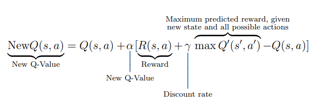

# Lab 3: Policy Search
## Task
    
Write agents able to play [*Nim*](https://en.wikipedia.org/wiki/Nim), with an arbitrary number of rows and an upper bound $k$ on the number of objects that can be removed in a turn (a.k.a., *subtraction game*).

The player **taking the last object wins**.

* Task3.1: An agent using fixed rules based on *nim-sum* (i.e., an *expert system*)
* Task3.2: An agent using evolved rules
* Task3.3: An agent using minmax
* Task3.4: An agent using reinforcement learning

## Solution

## Task 3.1 - Fixed rules

For the first task, I have defined some fixed rules and evaluated their performances against a **random player**:

*Pick maximum amount of matches in the highest row
*Pick minimum amount of matches in the highest row
*Pick maximum amount of matches in the lowest row
*Pick minimum amount of matches in the lowest row

Intuitively, it makes sense that picking the minimum from the highest row is better: essentially, it is generally convenient to have more matches available, so that it is more likely for the agent to take the last match (and therefore win).

To confirm this hypothesis, I tried to combine all these rules two by two in a `count_and_decide` function:
* If the active rows number is even, use the first chosen rule
* If the active rows number is odd, use the second chosen rule

Consistently, the best performing combinations were the ones in which the most matches were taken.

Then, this concept made me think of the following idea: we would want, in the end, to have the a configuration in which we have only two rows, composed of one match each!

        |   <---- opponent is obliged to take just one match!
        |   <---- 

This can be achieved by having a `count_and_decide` function that works in the following way:
* If the active rows are even, then choose a random row and pick all but one element
* If the active rows are odd, then choose a random row and pick all elements

In this way, I get a winning rate of 1. It may very likely be wrong and I did not see something obvious, so suggestions are welcome!

## Task 3.2 - Evolved rules 

For this task, I reused the evolutionary algorithm that I wrote in the second laboratory (The reader is invited to check it!).
The strategy depends on a probability **p**, which is effectively the genome considered for the population.

Given that the best performance was given by picking the most matches possible, this strategy will use **p** as a treshold:
* Choose a random row and pick all but one element as strategy, with probability **p**
* Otherwise, choose a random row and pick all elements

Other combination of functions could be tried, and I plan to add more.

The crossover consists in the mean of the probabilities (genomes) of two chosen genomes.
The mutation consists in changing such value completely.

## Task 3.3 - MiniMax agent

For the minmax problem, I developed a version of Minmax with Alpha-Beta Pruning, as it was more computionally efficient and lighter.

This agent performs very well against pure random strategy, reaching almost win_rate of 1. 

Against optimal strategy, instead, I get a weird behavior:
* If nim size is 4, I never beat the opponent
* If nim size is 5, I alwats beat the opponent

Suggestions are welcome here!

## Task 3.4 - Q-Learning agent

For this task I used a Q-Learning approach, which is shown in the formula here:

With Q-Learning, I get very good results, reaching almost win_rate of 1 against both random and optimal strategy!
Code for this task was taken and adapted from here: https://github.com/abelmariam/nimPy
I suggest you to look at it, as it could be very useful for future projects!

